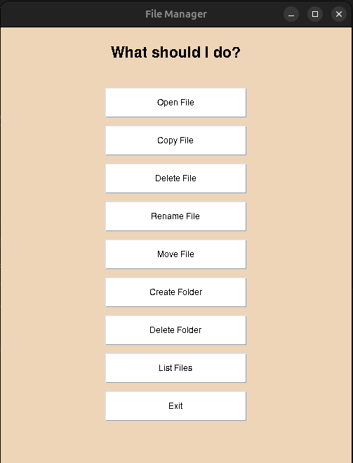

# Graphical File Manager GUI 🗂️

**FileManager** is a Python desktop application with a graphical interface that allows users to manage files and directories easily. It integrates **Tkinter** for GUI and **MySQL** for logging all operations.

---

## Features

- **Open Files** using the system default application (`xdg-open` on Linux)
- **Copy, Move, Rename, Delete Files**  
- **Create and Delete Directories**
- **List files** in a selected folder inside a scrollable window
- **Log all operations** in a MySQL database (`operations` table)
- **User-friendly GUI** with clearly labeled buttons for each action
- Error handling with informative pop-ups

---

## Screenshot



---

## Installation

1. **Clone the repository:**

```bash
git clone https://github.com/yourusername/Graphical-File-Manager.git
cd Graphical-File-Manager
```

2. **Install dependencies:**

```bash
pip install easygui mysql-connector-python
```

> Tkinter comes pre-installed with most Python versions.

3. **Set up MySQL database:**

```sql
CREATE DATABASE file_manager;

CREATE TABLE operations(
    id INT AUTO_INCREMENT PRIMARY KEY NOT NULL,
    operation VARCHAR(255) NOT NULL,
    path VARCHAR(1024) NOT NULL,
    do_at TIMESTAMP NOT NULL DEFAULT CURRENT_TIMESTAMP
);

CREATE USER 'fm_user'@'localhost' IDENTIFIED BY 'fm_pass';
GRANT ALL PRIVILEGES ON file_manager.* TO 'fm_user'@'localhost';
FLUSH PRIVILEGES;
```

---

## Usage

1. Run the application:

```bash
python file_manager.py
```

2. Use the GUI buttons to:

- Open files
- Copy, move, rename, delete files
- Create and delete folders
- List files in a folder
- Exit the program

3. All operations are automatically logged in the `operations` table in MySQL with timestamp.

---

## Dependencies

- Python 3.x
- Tkinter
- easygui
- mysql-connector-python

---

## File Structure

```
Graphical-File-Manager/
├── file_manager.py          # Main application
├── README.md                # This file
└── screenshot_fm.png        # Screenshot of the application
```

---

## Database Logging

Each file or folder operation is logged in MySQL:

| Column     | Type      | Description                     |
|------------|-----------|---------------------------------|
| id         | INT       | Auto-increment primary key       |
| operation  | VARCHAR   | Name of the operation           |
| path       | VARCHAR   | File or directory path           |
| do_at      | TIMESTAMP | Time of the operation            |

---

## Author

**Mohammad Amin Nasiri**  
